## API CINESPOILERS – PRUEBAS COMPLETAS

## MOVIES
1. GET – Listado de películas
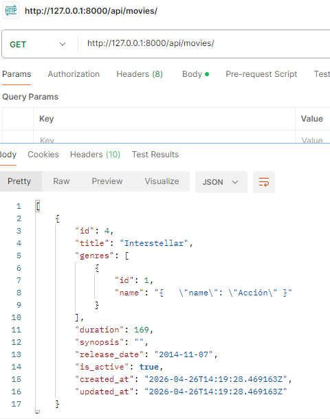

2. GET – Película por ID
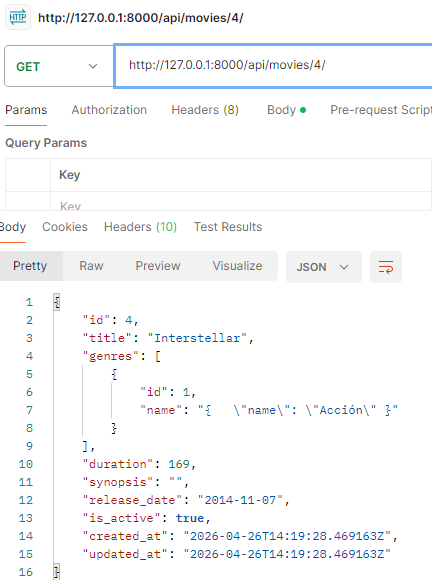

3. POST – Crear película
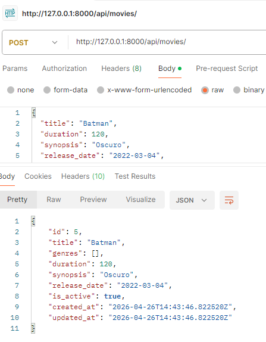

4. PUT – Actualizar película completa
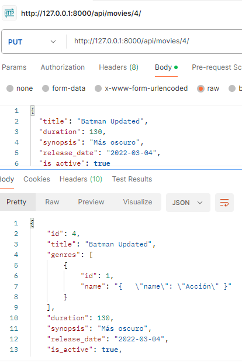

5. PATCH – Actualización parcial
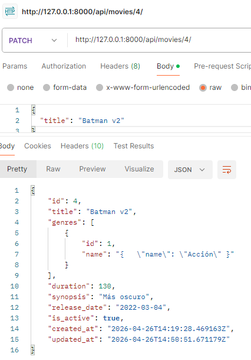

6. DELETE – Eliminar película
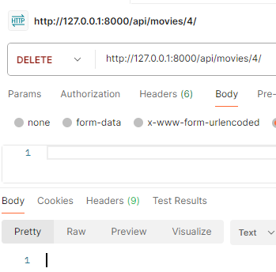

## GENRES
7. GET – Listado de géneros
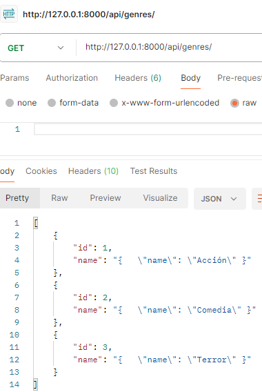

8. GET – Género por ID
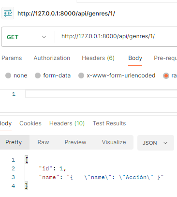

9. POST – Crear género
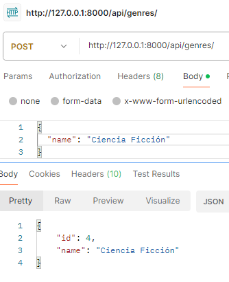

10. PUT – Actualizar género
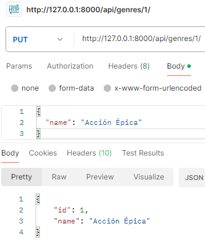

11. DELETE – Eliminar género
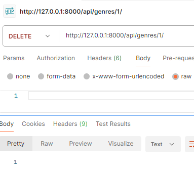
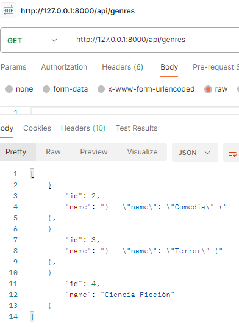

## AUTOR

Pablo Isla Arone