# 🎬 Cinespoilers API

Aplicación desarrollada en Django Rest Framework para gestionar películas en un sistema de cine mediante operaciones CRUD.

---

## 🚀 Tecnologías utilizadas

* Python
* Django
* Django Rest Framework
* SQLite
* Postman
* Git & GitHub

---

## 📸 Capturas de pantalla

### 🔹 POST - Registro de película

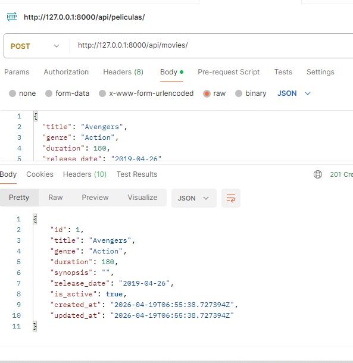

### 🔹 Base de datos después del POST

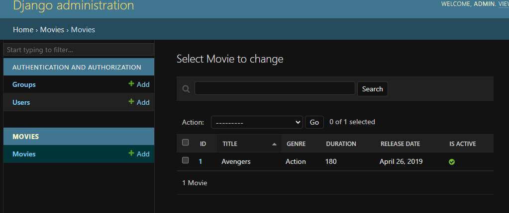

---

### 🔹 GET - Listado de películas

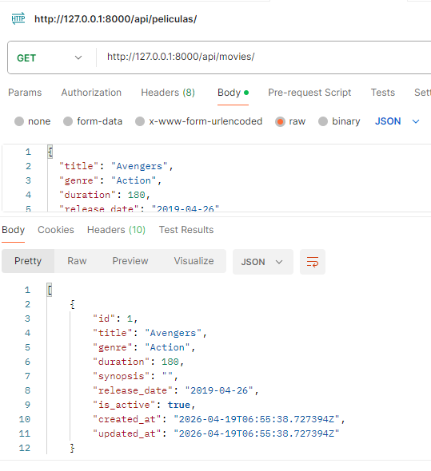

### 🔹 Base de datos - GET

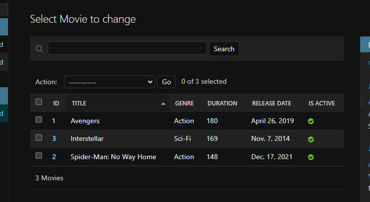

### 🔹 Vista en Django REST

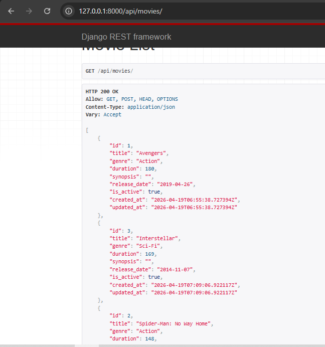

---

### 🔹 PATCH - Edición parcial

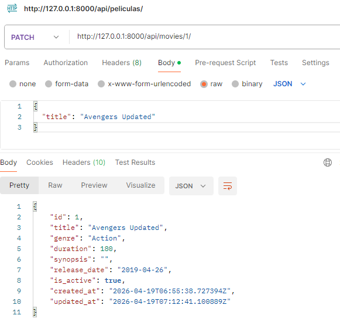

### 🔹 Vista en Django REST (PATCH)

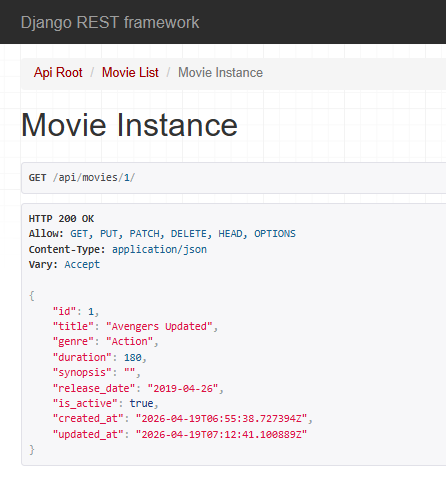

---

### 🔹 PUT - Actualización completa

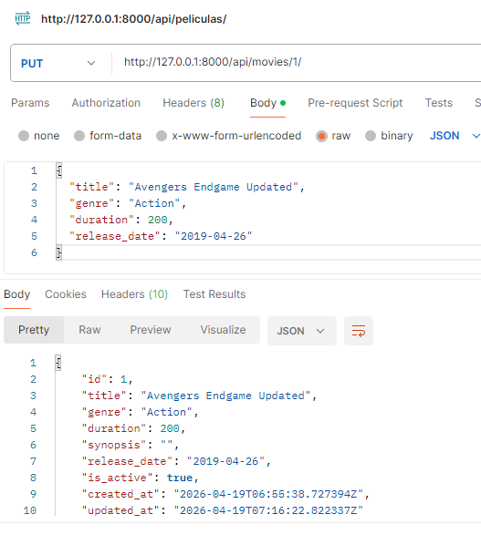

### 🔹 Base de datos después del PUT

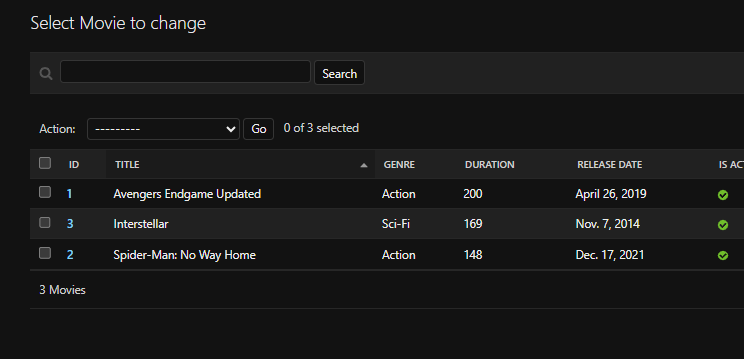

### 🔹 Vista en Django REST (PUT)

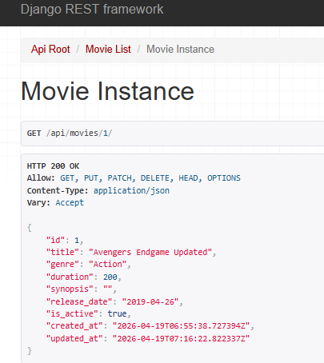

---

### 🔹 DELETE - Eliminación de película

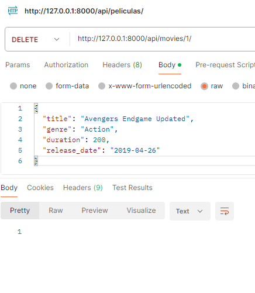

### 🔹 Base de datos después del DELETE

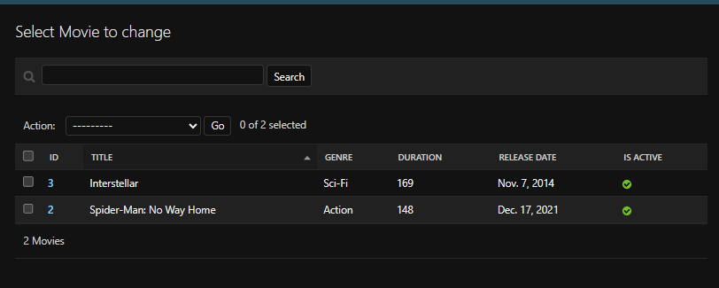

---

### 🔹 Panel de Administración

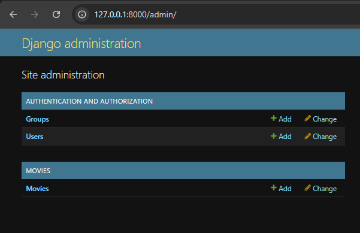

---

## 👨‍💻 Autor

**Pablo Isla Arone**
