# Implementación de API REST
---
## Andy Campos Escandon
## Piero Huaytalla Otarola
## Pablo Isla Arone

---

## Ejecución del proyecto (clonado)

### 1. Clonar repositorio

```bash
git clone https://github.com/Andy-CE17/Laboratorio-5.git
cd cinespoilers

2. Crear entorno virtual
python -m venv venv

3. Activar entorno virtual (Windows)
venv\Scripts\activate

4. Instalar dependencias
pip install -r requirements.txt

5. Aplicar migracionesgit status
python manage.py migrate

6. Crear superusuario (opcional)
python manage.py createsuperuser

7. Ejecutar servidor
python manage.py runserver

8. Acceder al sistema

API Root:
http://127.0.0.1:8000/api/

---
Movies API
http://127.0.0.1:8000/api/movies/

---
Genres API
http://127.0.0.1:8000/api/genres/

---
Rooms API
http://127.0.0.1:8000/api/rooms/

---
Showtimes API
http://127.0.0.1:8000/api/showtimes/

---
Tickets API
http://127.0.0.1:8000/api/tickets/

---
Admin
http://127.0.0.1:8000/admin/
```
### Salas (Room) y Funciones (Showtime) – Andy Campos Escandon

## Creación de sala (POST)
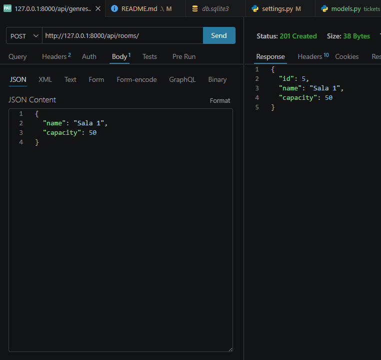
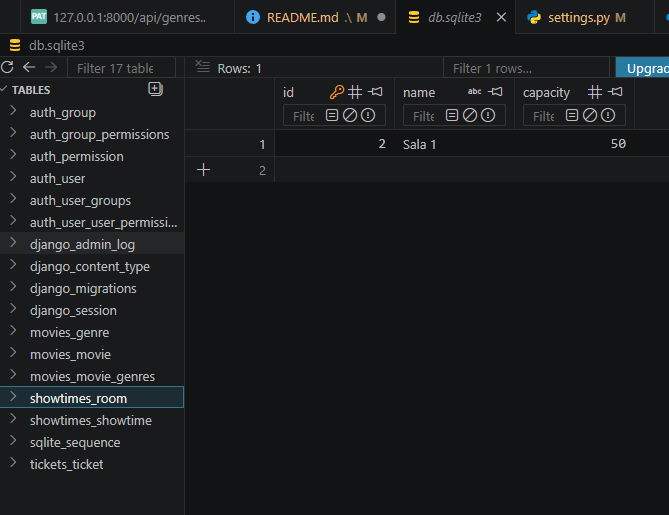

## Creación de función (POST)
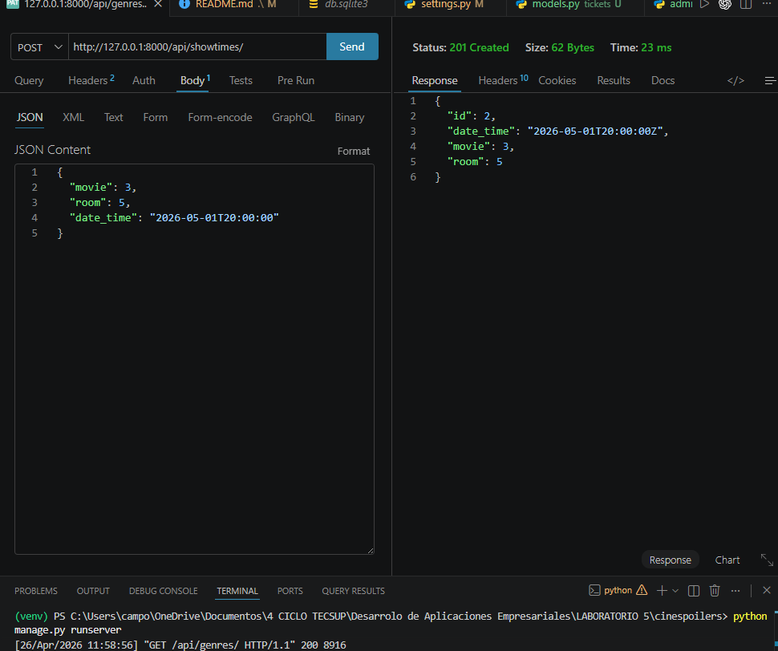
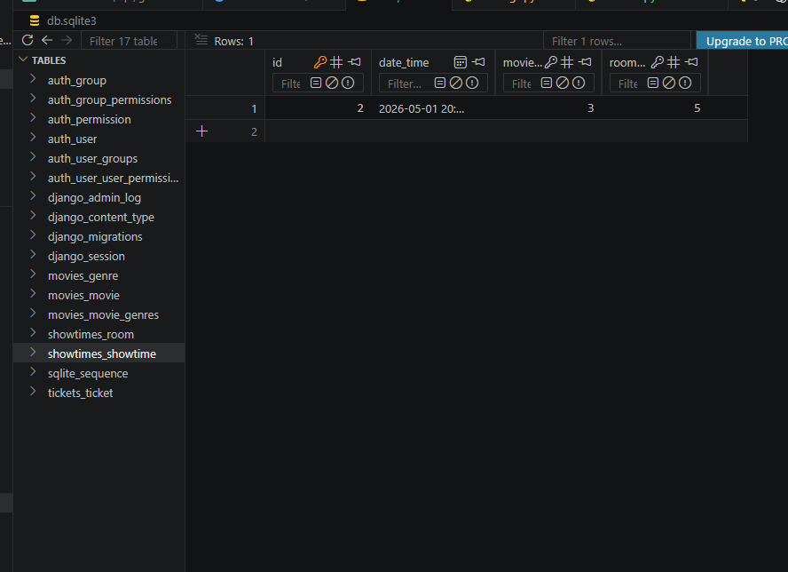

## Actualización completa (PUT)
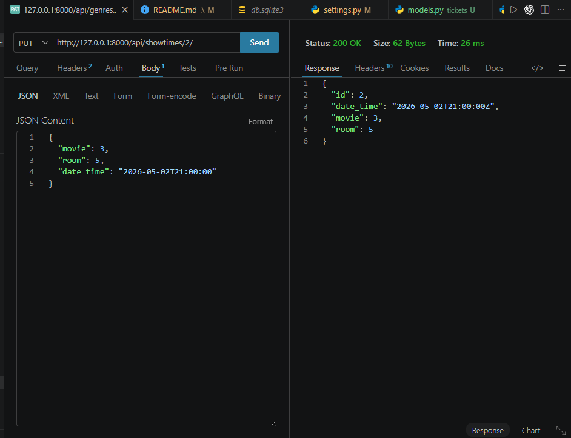
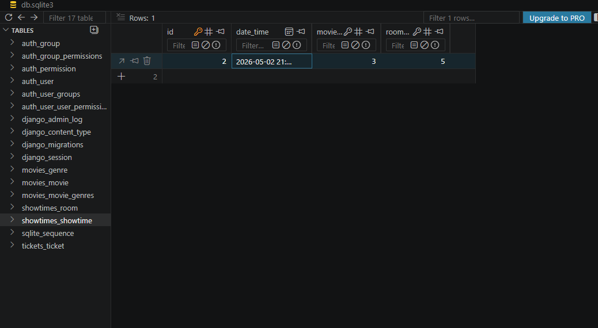

## Actualización parcial (PATCH)
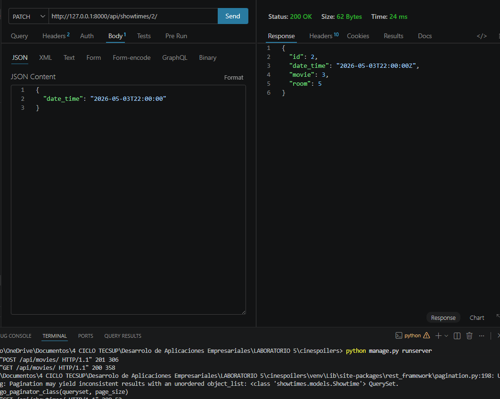
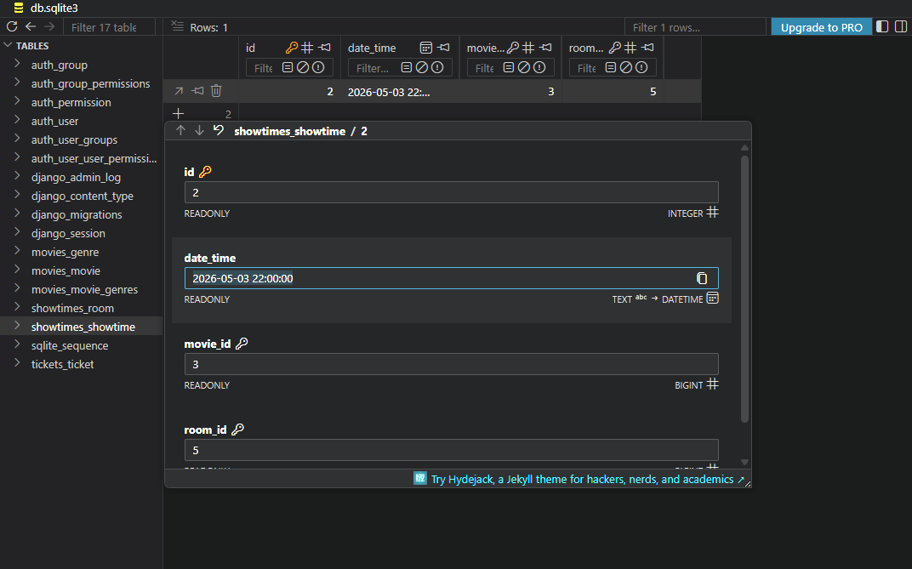

### Eliminación de función (DELETE)
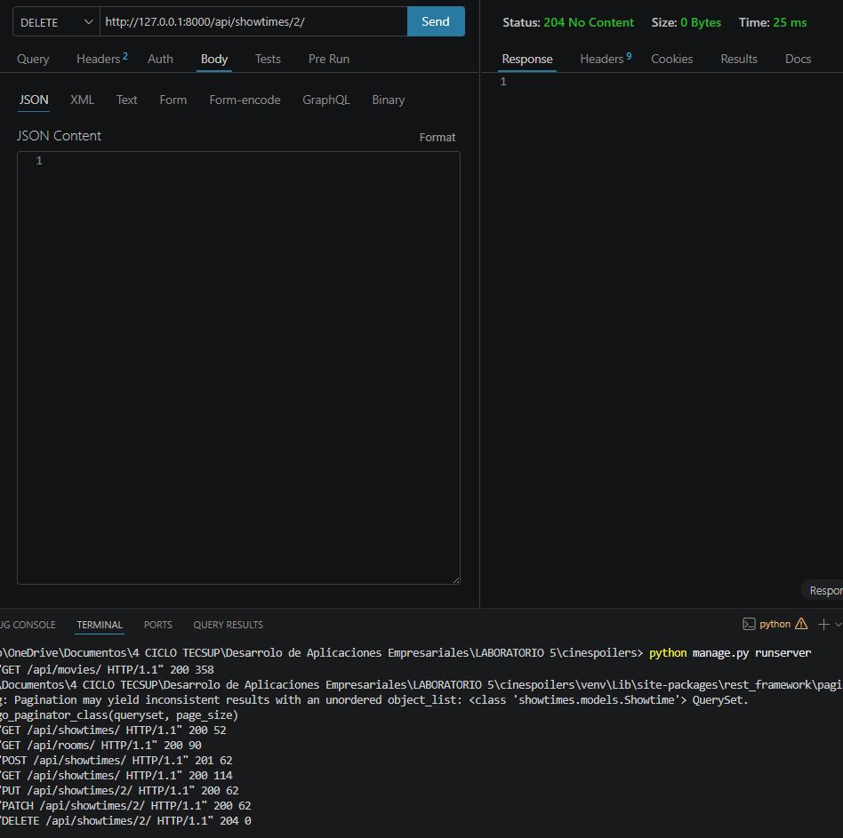
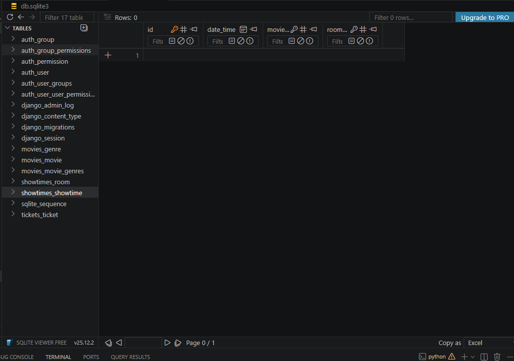

## Piero Huaytalla Otarola

## Genre List
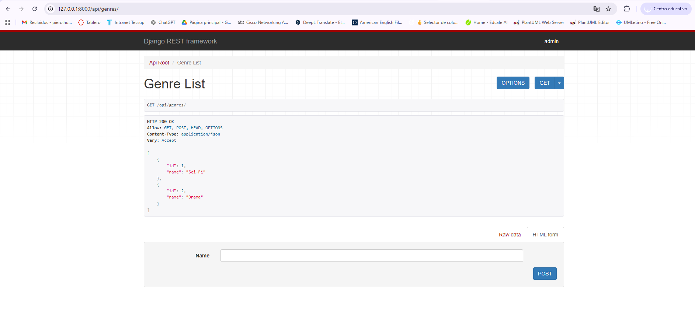

## Get Genres
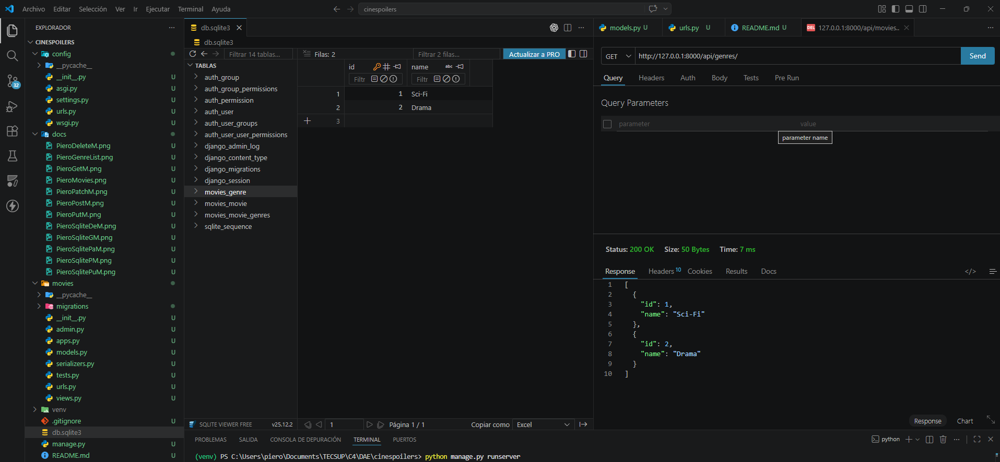

## Post Genres
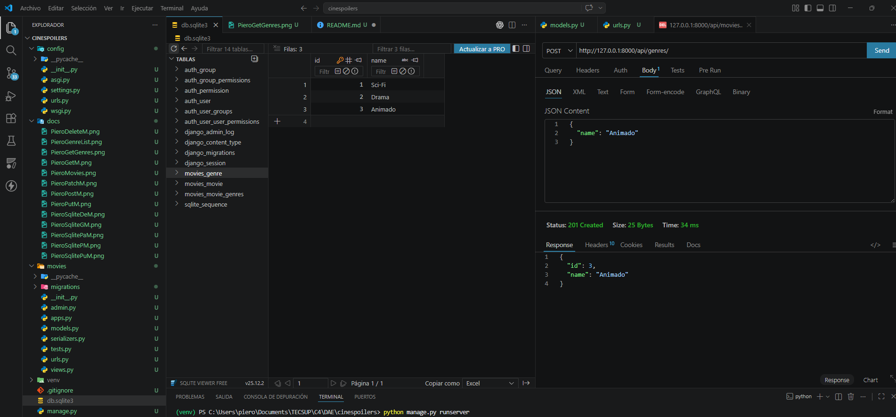

## Put Genres
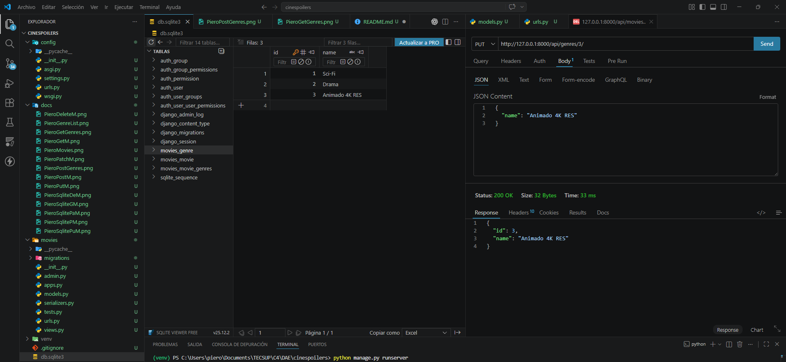

## Patch Genres
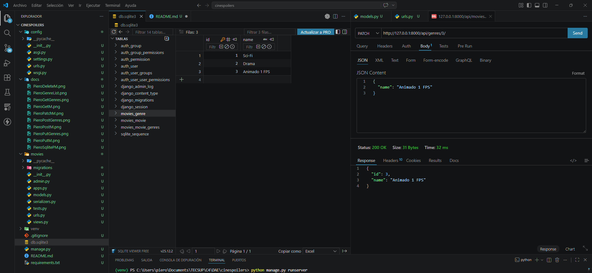

## Delete Genres
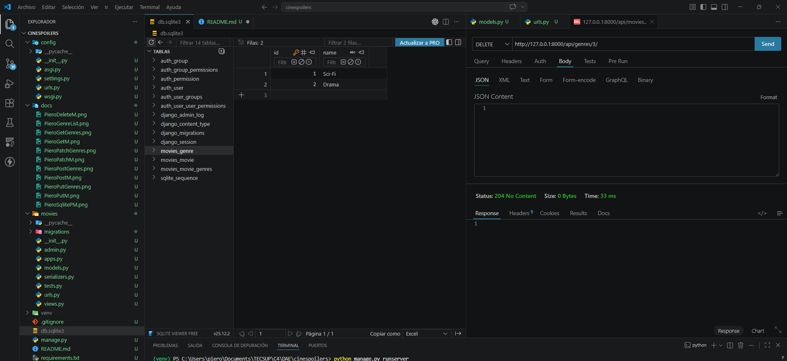

## Post Movie
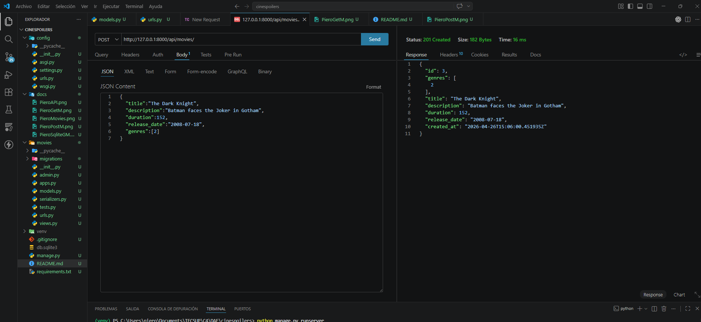


## AUTOR
Pablo Isla Arone

## MOVIES
1. GET – Listado de películas


2. GET – Película por ID


3. POST – Crear película


4. PUT – Actualizar película completa


5. PATCH – Actualización parcial


6. DELETE – Eliminar película


## GENRES
7. GET – Listado de géneros


8. GET – Género por ID


9. POST – Crear género


10. PUT – Actualizar género


11. DELETE – Eliminar género


## AUTOR

Pablo Isla Arone

